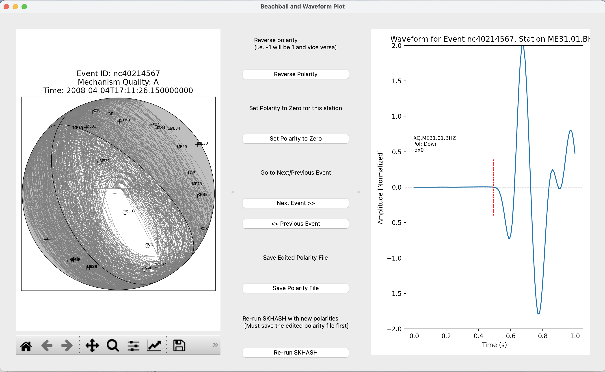

FocalMechanismPolarityEditor-GUI-SkHASH. Run SkHASH using a GUI, check polarities by plotting beachball with stations and waveforms side-by-side, edit and re-run skhash for improving Fault plane solution quality.

UI:




input parameters:

```
input_params = {
    'mech_path': mech_path,         # (outfile1) SKHASH results
    'alt_mech_path': alt_mech_path, # (outfile2) SKHASH output accepted mechanisms
    'pol_path': pol_path,           # SKHASH input polarities
    'pol_info_path': pol_info_path, # (outfile_pol_info) SKHASH output polarities (same as pol_path with additional info)
    'pol_agree_path': pol_agree_path,# (outfile_pol_agree) SKHASH output polarities with agreement
    'stn_path': stn_path,           # Master station csv (SKHASH format)
    'pick_pol_path': pick_pol_path, # phase picks and polarities csv (converted from pyrocko markers, filtered)
    'eq_cat_path': eq_cat_path,     # Earthquake catalog csv
    'mseed_dir': mseed_dir,
    'hor_line': True,
    'zoom': 2,
    'slice_len': 0.5,
    'normalize': True,
    # beachball plot parameters
    'acceptable_sdr': True,
    # SKHASH control file parameters
    'vmodel_paths': os.path.join(skhash_root_dir, 'examples/velocity_models_MTJ/vz_MTJ.txt'),
    'max_agap': 170,
    'delmax': 0,
    # Rerun SKHASH parameters
    'mini_or_ana': 'miniconda3',
    'skhash_dir': skhash_root_dir,
    'control_file_path': os.path.join(file_dir, 'control_file_app.txt')
}
```

How to:
1. Create environment with `environment.yml` file, tested on python==3.10, must have packages are numpy, pandas, obspy, pyqt5.
2. In terminal ``` python run_app_demo.py```.
   To change the input parameters, change values in the `input_params` in run_app_demo.py file.

# Citation:

Please cite our paper if you use anything in this project:

[](https://doi.org/10.5281/zenodo.13240156)

Islam. (2024). arif-geo/FMPE-GUI-SKHASH: FocalMechanism (FocalMechanism). Zenodo. https://doi.org/10.5281/zenodo.13240156

Skoumal, R.J., Hardebeck, J.L., Shearer, P.M. (2024). SKHASH: A Python package for computing earthquake focal mechanisms. Seismological Research Letters, 95(4), 2519-2526. https://doi.org/10.1785/0220230329


### Significant portions of this algorithm are based on HASH:

Hardebeck, J.L., & Shearer, P.M. (2002). A new method for determining first-motion focal mechanisms. Bulletin of the Seismological Society of America, 92(6), 2264-2276. https://doi.org/10.1785/0120010200

Hardebeck, J.L., & Shearer, P.M. (2003). Using S/P amplitude ratios to constrain the focal mechanisms of small earthquakes. Bulletin of the Seismological Society of America, 93(6), 2434-2444. https://doi.org/10.1785/0120020236


